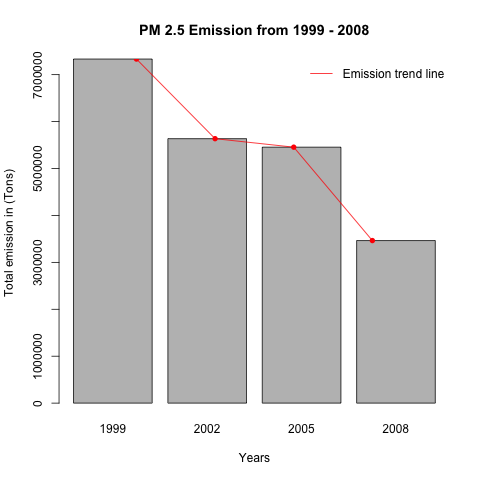
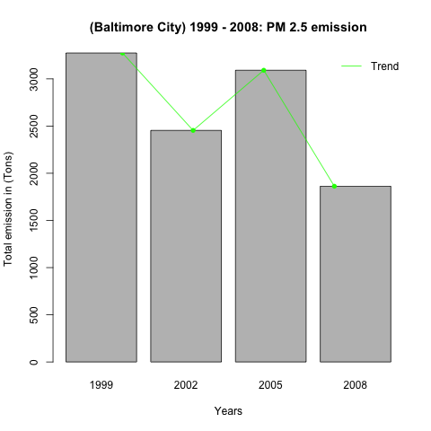
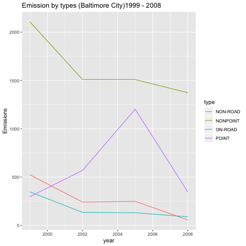
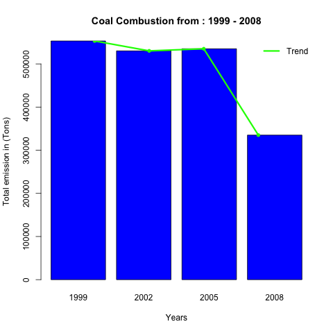

## Introduction

Fine particulate matter (PM2.5) is an ambient air pollutant for which there is strong evidence that it is harmful to human health. In the United States, the Environmental Protection Agency (EPA) is tasked with setting national ambient air quality standards for fine PM and for tracking the emissions of this pollutant into the atmosphere. Approximatly every 3 years, the EPA releases its database on emissions of PM2.5. This database is known as the National Emissions Inventory (NEI).

Our analysis will seek to gain some insight into the trends, over the years 1999 - 2008 about the state of 
PM 2.5( Particulate matter) over this time period

### What is in this readme file ?
This readme file will have explanations about code for various plots, and why they were used to answer certain
questions.

We will now look at the questions of interest:-
- 1 : Have total emissions from PM2.5 decreased in the United States from 1999 to 2008? Using the base plotting system, make a plot showing the total PM2.5 emission from all sources for each of the years 1999, 2002, 2005, and 2008

- 2 : Have total emissions from PM2.5 decreased in the Baltimore City, Maryland (fips=="24510") from 1999 to 2008? Use the base plotting system to make a plot answering this question.

- 3 : Of the four types of sources indicated by the type (point, nonpoint, onroad, nonroad) variable, which of these four sources have seen decreases in emissions from 1999–2008 for Baltimore City? Which have seen increases in emissions from 1999–2008? Use the ggplot2 plotting system to make a plot answer this question.

- 4: Across the United States, how have emissions from coal combustion-related sources changed from 1999–2008?

- 5 : How have emissions from motor vehicle sources changed from 1999–2008 in Baltimore City?

- 6: Compare emissions from motor vehicle sources in Baltimore City with emissions from motor vehicle sources in Los Angeles County, California (fips == "06037"). Which city has seen greater changes over time in motor vehicle emissions


## Plot 1: Have total emissions from PM2.5 decreased in the United States from 1999 to 2008?
We begin our analysis by looking at the loading our 2 data sets:-

```{r,eval=FALSE}
SCC <- readfiles("plot1.r","Source_Classification_Code.rds")
NEI <- readfiles("plot1.r","summarySCC_PM25.rds")
```

We then observe the basic structure of these data sets
SCC: 'data.frame':	11717 obs. of  15 variables:
NEI: 'data.frame':	6497651 obs. of  6 variables:

we now look at the column names of SCC:
 [1] "SCC"                 "Data.Category"       "Short.Name"          "EI.Sector"           "Option.Group"       
 [6] "Option.Set"          "SCC.Level.One"       "SCC.Level.Two"       "SCC.Level.Three"     "SCC.Level.Four"     
[11] "Map.To"              "Last.Inventory.Year" "Created_Date"        "Revised_Date"        "Usage.Notes"

provides a mapping from the SCC digit strings in the Emissions table to the actual name of the PM2.5 source. The sources are categorized in a few different ways from more general to more specific and you may choose to explore whatever categories you think are most useful.

We will print the first row of this SCC data set:-

|   SCC    | Data.Category |                                 Short.Name                                 |               EI.Sector                | Option.Group | Option.Set |        SCC.Level.One        |    SCC.Level.Two    |        SCC.Level.Three        |                SCC.Level.Four                 | Map.To | Last.Inventory.Year | Created_Date | Revised_Date | Usage.Notes |
|:--------:|:-------------:|:--------------------------------------------------------------------------:|:--------------------------------------:|:------------:|:----------:|:---------------------------:|:-------------------:|:-----------------------------:|:---------------------------------------------:|:------:|:-------------------:|:------------:|:------------:|:-----------:|
| 10100101 |     Point     |          Ext Comb /Electric Gen /Anthracite Coal /Pulverized Coal          | Fuel Comb - Electric Generation - Coal |              |            | External Combustion Boilers | Electric Generation |        Anthracite Coal        |                Pulverized Coal                |   NA   |         NA          |              |              |             |
| 10100102 |     Point     | Ext Comb /Electric Gen /Anthracite Coal /Traveling Grate (Overfeed) Stoker | Fuel Comb - Electric Generation - Coal |              |            | External Combustion Boilers | Electric Generation |        Anthracite Coal        |       Traveling Grate (Overfeed) Stoker       |   NA   |         NA          |              |              |             |
| 10100201 |     Point     |    Ext Comb /Electric Gen /Bituminous Coal /Pulverized Coal: Wet Bottom    | Fuel Comb - Electric Generation - Coal |              |            | External Combustion Boilers | Electric Generation | Bituminous/Subbituminous Coal | Pulverized Coal: Wet Bottom (Bituminous Coal) |   NA   |         NA          |              |              |             |
| 10100202 |     Point     |    Ext Comb /Electric Gen /Bituminous Coal /Pulverized Coal: Dry Bottom    | Fuel Comb - Electric Generation - Coal |              |            | External Combustion Boilers | Electric Generation | Bituminous/Subbituminous Coal | Pulverized Coal: Dry Bottom (Bituminous Coal) |   NA   |         NA          |              |              |             |
| 10100203 |     Point     |          Ext Comb /Electric Gen /Bituminous Coal /Cyclone Furnace          | Fuel Comb - Electric Generation - Coal |              |            | External Combustion Boilers | Electric Generation | Bituminous/Subbituminous Coal |       Cyclone Furnace (Bituminous Coal)       |   NA   |         NA          |              |              |             |

We will now look at NEI:- 

| &nbsp; | fips  |   SCC    | Pollutant | Emissions | type  | year |
|:------:|:-----:|:--------:|:---------:|:---------:|:-----:|:----:|
| **4**  | 09001 | 10100401 | PM25-PRI  |   15.71   | POINT | 1999 |
| **8**  | 09001 | 10100404 | PM25-PRI  |   234.2   | POINT | 1999 |

fips: A five-digit number (represented as a string) indicating the U.S. county

SCC: The name of the source as indicated by a digit string (see source code classification table)

Pollutant: A string indicating the pollutant

Emissions: Amount of PM2.5 emitted, in tons

type: The type of source (point, non-point, on-road, or non-road)

year: The year of emissions recorded


Now that we have a handle of what the datastes represent.

To solve our question, we need to calculate the total emission of all sources of PM2.5 emission, on a per
yearly basis.

This is accomplished using the tapply function: where, emission is caluclated, subset by years, and sum is the function to find the total.

```{r,eval=FALSE}
#using tapply to subset across all years and apply this sum function
plot1Result <- tapply(NEI$Emissions, NEI$year, sum)
```

plot1Result now has the subsetted totals by year. 

we view it now:
> plot1Result
   1999    2002    2005    2008 
7332967 5635780 5454703 3464206 

Now I decided to use a barplot to, plot the total emission for each year:-

```{r,eval=FALSE}
# Plotting the data
options(scipen = 999) #deactivate scientific notations
```
```{r,eval=FALSE}
barplot(plot1Result, xlab = "Years", ylab = "Total emission in (Tons)", main = "PM 2.5 Emission from 1999 - 2008")
```

This line generates the bar plot. However to make the plot more descriptive and make trends apparent. I added a trend line with a legend indicating the data's trend.

```{r,eval=FALSE}
lines(plot1Result, col = "red")
points(plot1Result, pch = 16, col = "red")
legend("topright",legend = c("Emission trend line"),lty = 1,col ="red", bty = "n")
```

The final result of the plotting code is show below:-


From the plot the following is apparent:
- There has been a decrease in the PM 2.5 pollutant over a period from 1999 - 2008
- Also the trend lines show how steep the decrease is between the various box plots
- There has been a particularly steep decrease from 2005 - 2008.

### Answer: Emissions have indeed decreased from 1999 to 2008 

## Plot 2: Have total emissions from PM2.5 decreased in the Baltimore City, Maryland (fips=="24510") from 1999 to 2008?
To do this we begin by grouping the data by fips and year
```{r,eval=FALSE}
baltimoreonly <- group_by(NEI, year)
baltimoreonly <- group_by(baltimoreonly, fips, add = TRUE)
baltimoreonly <- summarize_at(baltimoreonly,.vars = c("Emissions") ,.funs = sum)%>%filter(fips == "24510")
```

> print(baltimoreonly)
# A tibble: 4 x 2
# Groups:   year [4]
   year Emissions
  <int>     <dbl>
1  1999     3274.
2  2002     2454.
3  2005     3091.
4  2008     1862.

Then we prepare the data as a 1 dimensional array of emissions, with years as attributes to be used inside the barplot

```{r,eval=FALSE}
#convert the data into a one dimensional array with attributes for display in barplot

length(baltimoreonly$year)
arrayForBarplot <- array(baltimoreonly$Emissions, dim = length(baltimoreonly$year))
dimnames(arrayForBarplot) <- list(baltimoreonly$year)
```

Finally. plot the result:-
```{r,eval=FALSE}
png(path1,width = 480, height = 480)
barplot(arrayForBarplot, xlab = "Years", ylab = "Total emission in (Tons)", main = "(Baltimore City) 1999 - 2008: PM 2.5 emission")
lines(arrayForBarplot, col = "green")
points(arrayForBarplot, pch = 16, col = "green")
legend("topright",legend = c("Trend"),lty = 1,col ="green", bty = "n")

```

The final result of the plotting code is show below:-


From the plot the following is apparent:
- There has been a decrease in the PM 2.5 pollutant over a period from 1999 - 2008
- There was a spike in polluton between 2002 and 2005
- After which pollution has fallen in 2008 

## Plot 3: Of the four types of sources indicated by the type type (point, nonpoint, onroad, nonroad) variable, which of these four sources have seen decreases in emissions from 1999–2008 for Baltimore City? Which have seen increases in emissions from 1999–2008? Use the ggplot2 plotting system to make a plot answer this question.

To do this we begin by grouping, by year, by type and by fips for Baltimore City:
```{r,eval=FALSE}
typeyearsubset <- group_by(NEI, year)
typeyearsubset <- group_by(typeyearsubset,type, add = TRUE)%>%filter(fips == "24510")
```

Then run the qplot from the ggplot package to plot the trends for the differet source types:
```{r,eval=FALSE}
p <- ggplot(typeyearsubset, aes(year,Emissions))+geom_line(aes(color = type))+labs(x="year", y=expression("Total PM"[2.5]*" Emission (Tons)"))
p+labs(title=expression("Emission by types (Baltimore City)1999 - 2008"))

```

The final result of the plotting code is show below:-


From the plot the following is apparent:
- There has been a marked increase in pollution from "point" type source betweem 2002 - 2005
- The remaining point types have shown no appreciable increase, but have been on a downward trend
- So the type "point" seems to explain the reason for the spike in PM2.5 pollution in plot2.

## Plot 4: Across the United States, how have emissions from coal combustion-related sources changed from 1999–2008?

To do this we subset the SCC codes for coal+ combustion. We then use the SCC codes from the (coal+combustion) subset to extract only the rows from NEI, that share the common SCC codes from the (coal+combustion)subset before plotting it.

```{r,eval=FALSE}
indexforCombustion <- grep("[C,c]omb",SCC$SCC.Level.One) # rows filtered by combustion
indexforCoal <- grep("[C,c]oal", SCC$SCC.Level.Three) # rows filtered by coal.

#we need the values for combustion by coal. So we will be using these 2 indexes
options(scipen = 999) #deactivate scientific notations
SCCCombustion <- SCC[indexforCombustion,]
SCCCCoal <- SCC[indexforCoal,]
SCCCCoal <- SCCCCoal[(SCCCCoal$SCC%in%SCCCombustion$SCC),]


NEIFiltered <-  NEI[(NEI$SCC%in%SCCCCoal$SCC),] # this gives us the coal combustion sources (subsetted)
typeyearsubset <- group_by(NEIFiltered, year)
typeyearsubset <- summarize_at(typeyearsubset, .vars = c("Emissions") ,.funs = sum)
```

The final result of the plotting code is show below:-


From the plot the following is apparent:
- There has been a noticable decrease in coal combustion form 2005 - 2008

